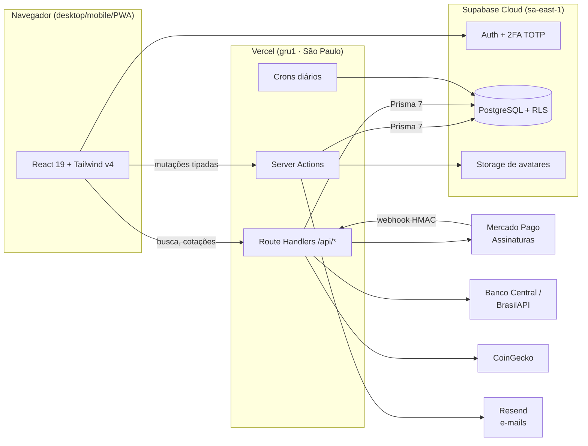
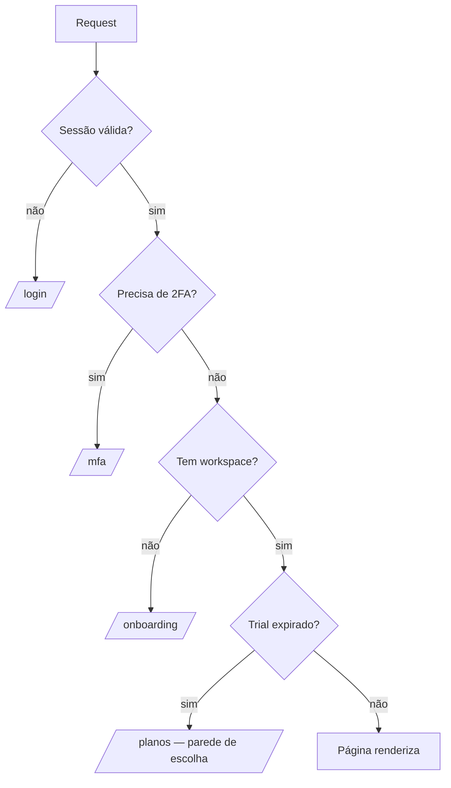

# Arquitetura do Zaldo

## Visão geral



## Decisões principais

### Server Actions em vez de REST interno
Quase todo o CRUD (lançamentos, convites, planos, perfil) são funções server-side com
validação Zod, chamadas direto pelos componentes. Menos superfície de API, tipagem de ponta a
ponta, zero boilerplate de fetch.

### Um único gate de autorização
Toda rota protegida passa por `requireWorkspace()`:



Regras de negócio de acesso vivem num lugar só — nenhuma página reimplementa checagem.

### Multi-tenant por workspace
Cada usuário pode ter vários espaços (pessoal + famílias). Toda tabela de dados carrega
`workspace_id`, e o isolamento é garantido em **duas camadas**: nas queries (Prisma sempre
filtra pelo workspace ativo) e no próprio Postgres via Row Level Security — um bug de
aplicação não vaza dados de outro espaço.

### Divisão de despesas em família
Despesas do workspace família podem ser divididas (igual, percentual ou valores custom). O
cálculo é feito **em centavos** com o resto indo pro primeiro membro — a soma sempre bate
(veja `exemplos/lib/split-calc.ts`). Cada membro escolhe se a sua parte aparece no resumo do
workspace pessoal dele.

### Contas fixas no automático
Recorrências (aluguel, assinatura, salário) são materializadas em lançamentos reais por um
cron diário protegido por Bearer secret — o app nunca "calcula em cima da hora"; o que você
vê na lista é o que existe no banco.

### Dados de mercado com fallback
CDI/Selic/poupança vêm do Banco Central; o dólar tenta a AwesomeAPI e cai pro PTAX (BCB via
BrasilAPI) quando ela limita os IPs do serverless. Nenhuma cotação indisponível derruba a
página — tudo degrada pra "—".

## Estrutura de pastas (projeto real)

```
src/
├── app/
│   ├── (auth)/          login, signup, reset — layout próprio
│   ├── (app)/           área autenticada (dashboard, lançamentos, família…)
│   ├── admin/           painel do operador (stats, usuários, auditoria)
│   ├── api/             route handlers (webhooks, crons, busca, market, export)
│   ├── onboarding/      criação do primeiro workspace
│   └── planos/          parede de planos pós-trial + retorno do checkout
├── components/
│   ├── ui/              design system (Select, DatePicker, CurrencyInput, Modal…)
│   ├── dashboard/       componentes da área logada
│   └── marketing/       landing page
└── lib/
    ├── data/            camada de leitura (queries Prisma tipadas por página)
    ├── market/          integrações de cotações
    └── *.ts             auth, audit, finance, split-calc, mercadopago, email…
```
