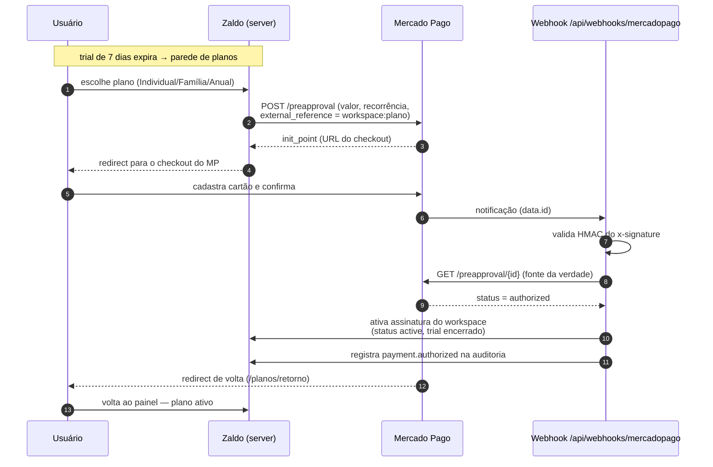

# Fluxo de pagamento (assinatura recorrente)

O Zaldo usa a API de **Assinaturas (preapproval)** do Mercado Pago: o usuário cadastra o
cartão uma vez e o MP renova sozinho (mensal ou anual). Não guardamos dados de cartão —
o checkout é hospedado pelo próprio Mercado Pago.

## Estados e cancelamento

| Evento no MP | Efeito no Zaldo |
|---|---|
| `authorized` | Plano ativado, `trialEndsAt` limpo, ids do gateway salvos |
| `cancelled` / `paused` | Assinatura marcada como `canceled` — na próxima navegação o dono cai na parede de planos |

O cancelamento derruba **apenas** se o id da assinatura cancelada é o mesmo que ativou o
workspace — uma assinatura antiga cancelada não afeta um plano recém-contratado.

## Por que nunca confiar no payload do webhook?

Qualquer um pode enviar um POST pro endpoint. Por isso:

1. **Assinatura HMAC**: o header `x-signature` é validado contra o secret do app
   (manifest oficial `id:…;request-id:…;ts:…;`, comparação em tempo constante).
2. **Re-busca**: mesmo com assinatura válida, o estado usado é o que a API do MP retorna
   pro nosso token — o corpo da notificação serve só para saber *qual* assinatura consultar.

Um payload forjado, no máximo, nos faz consultar uma assinatura que não existe.

## Modo desenvolvimento

Sem `MERCADOPAGO_ACCESS_TOKEN` no ambiente, a escolha de plano ativa direto (sem cobrança) —
permite testar todo o fluxo de trial/parede/planos localmente sem tocar no gateway.
